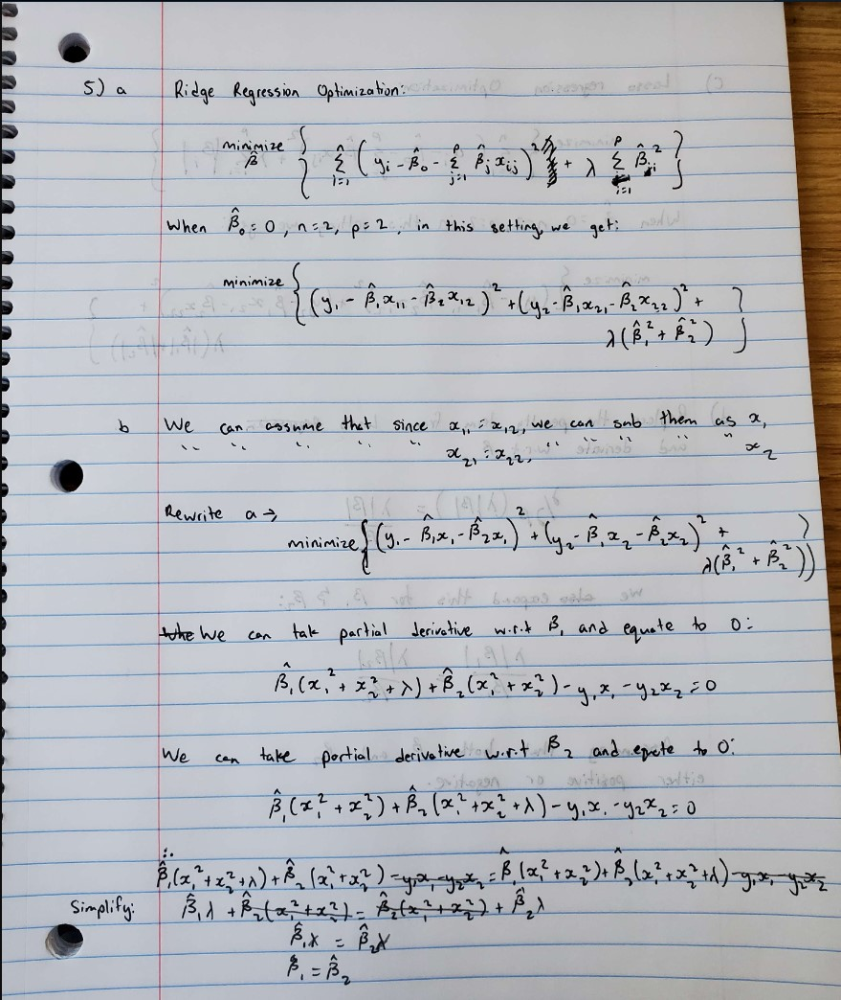
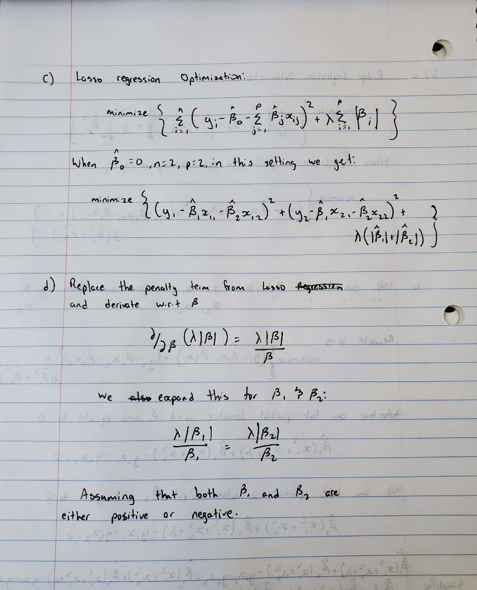

#Recitation Problems

#Chapter 6

#1.

(a) The best subset selection will have the lowest training RSS because it fits all Pk models that contain exactly k predictors. All combinations of p are taken into consideration here. This is not the case with forward and backward stepwise selection because they are greedy and don't consider all predictors.

(b) For smallest test RSS, it is difficult to say based on the given information because best subset selection considers all predictors and has lowest training RSS so it may also have lowest testing RSS, however, it may overfit. The other two models, since they avoid overfitting, may also find a model that gives the lowest testing RSS.

#(c) 

i - True - In forward stepwise selection, we add one additional parameter in Mk and so we select the best model within the predictors of the (k+1) variable

ii - True - In backward stepwise selection, we use the subset of the predictors in the (k+1) variable model and remove one predictor

iii - False - The predictors in backward stepwise selection are only identified by a subset of predictors in the k+1 variable model by the backward stepwise selection because the model will contain all but one predictor, therefore both models end up selecting different predictors

iv - False - The predictors in forward stepwise selection are only identified by a subset of predictors in the k+1 variable model by the forward stepwise selection because the model will contain one additional predictor, therefore both models end up selecting different predictors

v - False - The best subset selection predictors are not identified by a subset from the k+1 variable. It fits all k variables and contains exactly k predictors

#2. 

(a) iii. Since Lasso yields sparse models meaning only a subset of variables is used so the model is less flexible. Additionally, as our lambda increases and we perform shrinkage and variable selection, the variance significantly decreases more than the increase in bias so we have a bias/variance trade off which gives improved prediction accuracy.

(b) iii. Ridge regression follows the same concept as above but we only perform shrinkage so our features shrink close to 0 but not exactly to 0. This means that as p goes closer to n, the increase in bias is less than the decrease in variance.

(c) ii. Non-linear models have high flexibility which means that the variance increases and so for improved predictions, we will have a significant decrease in bias and a slight increase in variance.

#3. 
(a) iv. The training RSS will steadily decrease as we increase s from 0 because as s increases, the least square solution falls within this budget and will become less restrictive. Therefore, the training RSS will steadily decrease until it yields this solution.

(b) ii. The testing RSS will initially decrease but as it fits the model, flexibility increases which will cause overfitting to occur and result in an increase in RSS.

(c) iii. The variance will steadily increase as our model flexibilty increases

(d) iv. The bias will steadily decrease as our model flexibility increases

(e) v. The irreducible error is not dependent on s therefore it remains constant

#4.
(a) iii. The training RSS will steadily increase because an increase in lambda will also increase the penalty term

(b) ii. The testing RSS will initially decrease but as it fits the model, flexibility decreases which will cause overfitting to occur and result in an increase in RSS.

(c) iv. The variance will steadily decrease as our model flexibilty decreases

(d) iii. The bias will steadily increase as our model flexibility decreases

(e) v. The irreducible error is not dependent on lambda therefore it remains constant

#5. 




#Chapter 7

#2. 
(a) As lambda goes to infinity, the penalty term is significant, g(x) = 0 and hence g_hat =0

(b) As lambda goes to infinity, and g^1(x) = 0, then g_hat will be a constant

(c) As lambda goes to infinity and m = 2, g^2(x) = 0 which will result in a straight line, a function ax+b

(d) As lambda goes to infinity and m = 3, g^3(x) = 0 which will result in a quadratic plot, a function ax^2 + bx + c

(e) As lambda is 0, there will be no penalty term applied to g_hat. This means that the straight line will be drawn through all points perfectly

#3.
```{r}
library(ggplot2) 

x <- -2:2 

y <- 1+x+-2*(x-1)^2*I(x>1) 

plot(x, y, type="o")
```
From above, we can see that when X goes from -2 to 1, the estimated curve is linear which results in a slope and y intercept of 1. However, when X is greater than one, we can observe a quadratic estimated curve.

#4.
```{r}
x <- -2:2 
y <- c(1 + 0 + 0, # x = -2 
 1 + 0 + 0, # x = -1 
 1 + 1 + 0, # x = 0 
 1 + (1-0) + 0, # x = 1 
 1 + (1-1) + 0 # x =2 
) 
plot(x,y, type = "o") 
```
The estimated curve from above shows a slope of -2

#5.
(a) As lambda goes to infinity, g_2_hat will have a smaller training RSS because it is a more flexible model. It is more flexible because it has a higher penalty term of the fourth derivative order when compared to g_1_hat which has a lower penalty term.

(b) As lambda goes to infinity, g_1_hat is more likely to have a smaller training RSS because it is less likely to overfit due to it's lower derivative penalty term. Since g_2_hat is more flexible and has lower training RSS, it may overfit on test RSS.

(c) Since lambda is 0 here, there will be no penalty term applied in neither models. This means that both models will have the same train/test RSS.

```{r}
#Import necessary libraries
data("mtcars")
data("swiss")
library(glmnet)
library("readxl")
library(mgcv)
library(visreg)
```

```{r}
#Problem 1

#Load mtcars sample dataset into dataframe
mtcars <- data.frame(mtcars)
set.seed(5)

#Perform a basic 80/20 test-train split
split <- sample(c(rep(0, 0.8 * nrow(mtcars)), rep(1, 0.2 * nrow(mtcars))))
train  <- mtcars[split == 0, ]
test   <- mtcars[split == 1, ]

summary(mtcars)
head(mtcars)
cat("Dimensions of training data: ", dim(train))
cat("\nDimensions of testing data: ", dim(test))
```

```{r}
#fit a linear model using mpg as target response
lm <- lm(mpg ~ ., data=train)
summary (lm)
```
#Explain what features are relevant based on t-statistic
#A smaller t-value indicates high similarity/relationship between two features. 

#Based on the t-value observations from the linear model fit, we can say that features hp and wt (with wt being the most relevant) are selected as the most relevant features.

```{r}
#What are the associated coefficient values for relevant features?
lm$coefficients
```

```{r}
#The out-of-sample test set performance (using predict) on the regular linear model:
y_hat <- predict(lm, test, type = "response")
y <- test[ , "mpg"]
MSE <- mean((y_hat - y)^2)
cat("OOS MSE on testing data: ", MSE)
```

```{r}
#Perform a ridge regression using glmnet

#pass x matrix and y vector:
x <- model.matrix(mpg ~ ., data=train )[, -1]
y <- train$mpg

#Perform ridge regression using 100 values of lambda for tuning
grid <- 10^seq(10, -2, length = 100)
ridge.mod <- cv.glmnet(x, y, alpha = 0, lambda = grid, parallel=TRUE)

```

```{r}
min_lambda <- ridge.mod$lambda.min
cat("Minimum value of Lambda: ", min_lambda)
```

```{r}
#Plot training MSE as a function of log Lambda
plot(ridge.mod)
```
```{r}
# Fitting Ridge Regression with optimal lambda
ridge.mod2 <- glmnet(x, y, alpha = 0, lambda = min_lambda)

coef(ridge.mod2)
```
#By observing the coefficients in the regular linear model and the ridge regression model from above, the coefficients have come closer to zero. Since none of the coefficients are zero, ridge reggression here does not perform variable selection but instead performs shrinkage.


```{r}
#pass x matrix on testing
x_test <- model.matrix(mpg~. ,test)[,-1]

# Predict out-of-sample test set performance 
y_hat_test <- predict(ridge.mod2, s = min_lambda, newx = x_test)
y_test <- test[, "mpg"]
test_MSE <- mean((y_hat_test - y_test)^2)

cat("Out-of-Sample test set performance MSE: ", test_MSE)

```
#By observing the out of sample test set performance MSE from the regular linear model (3.97) and the ridge regression model (2.33), the MSE has decreased which shows that the ridge regression model has performed better. After observing the coefficients and the MSE of both models, we can say that the ridge regression model has performed shrinkage.

```{r}
#Problem 2

#Load swiss sample dataset into dataframe
swiss <- data.frame(swiss)
set.seed(5)

#Perform a 80/20 test-train split
split <- sample(c(rep(0, 0.8 * nrow(swiss)), rep(1, 0.2 * nrow(swiss))))
train <- swiss[split == 0, ]
test <- swiss[split == 1, ]

summary(swiss)
head(swiss)
cat("Dimensions of training data: ", dim(train))
cat("\nDimensions of testing data: ", dim(test))
```

```{r}
#fit a linear model using Fertility as target response
lm <- lm(Fertility ~ ., data=train)
summary (lm)
```
#Explain what features are relevant based on t-statistic
#A smaller t-value indicates similarity/relationship between two features. 

#Based on the t-value observations from the linear model fit, we can say that features Education and Agriculture (with Education being the most relevant) are selected as the most relevant features.

```{r}
#What are the associated coefficient values for relevant features?
lm$coefficients
```

```{r}
#The out-of-sample test set performance (using predict) on the regular linear model:
y_hat <- predict(lm, test, type = "response")
y <- test[ , "Fertility"]
MSE <- mean((y_hat - y)^2)
cat("OOS MSE on testing data: ", MSE)
```

```{r}
#Perform a lasso regression using glmnet

#pass x matrix and y vector:
x <- model.matrix(Fertility ~ ., data=train )[, -1]
y <- train$Fertility

#Perform lasso regression using 100 values of lambda for tuning
grid <- 10^seq(10, -2, length = 100)
lasso.mod <- cv.glmnet(x, y, alpha = 1, lambda = grid, parallel=TRUE)

```

```{r}
min_lambda <- lasso.mod$lambda.min
cat("Minimum value of Lambda: ", min_lambda)
```

```{r}
#Plot training MSE as a function of log Lambda
plot(lasso.mod)
```
```{r}
# Fitting Lasso Regression with optimal lambda
lasso.mod2 <- glmnet(x, y, alpha = 1, lambda = min_lambda)

coef(lasso.mod2)
```
#By observing the coefficients in the regular linear model and the lasso regression model from above, there isn't much difference, however, some shrinkage is observed. 

#Typically, with lasso, we would expect to see shrinkage and then variable selection occuring. However, since none of the coefficients have shrunk to 0, we can say that our lasso model only performs shrinkage and not both shrinkage and variable selection.


```{r}
#pass x matrix on testing
x_test <- model.matrix(Fertility~. ,test)[,-1]

# Predict out-of-sample test set performance 
y_hat_test <- predict(lasso.mod2, s = min_lambda, newx = x_test)
y_test <- test[, "Fertility"]
test_MSE <- mean((y_hat_test - y_test)^2)

cat("Out-of-Sample test set performance MSE: ", test_MSE)

```
#By observing the out of sample test set performance MSE from the regular linear model (49.85) and the lasso regression model (47.95), the MSE has slightly decreased which shows that the lasso regression model has performed slightly better. 


```{r}
#Problem 3

#Load Concrete Compressive Strength sample dataset from UCI Repository into dataframe using readxl package
set.seed(5)
CCS_data <- read_excel("D:\\Users\\giris\\Downloads\\Concrete_Data.xls")
colnames(CCS_data) <- c("C1","C2","C3","C4","C5","C6","C7","C8","CCS")

summary(CCS_data)
head(CCS_data)
```

```{r}
#Using gam function to predict the CCS as a non-linear function of the input features C1-C6

GAM_non_linear <- gam(CCS ~ C1+C2+C3+C4+C5+C6, data=CCS_data)
summary(GAM_non_linear)

```
#With an adjusted R^2 of 0.445 from this model, only 45% of the variance is explained in this model which means that there is not a strong correlation between the predictors and response variables.

```{r}
#Creating a GAM with linear terms as well as smoothed terms
GAM_linear <- gam(CCS ~ s(C1)+s(C2)+s(C3)+s(C4)+s(C5)+s(C6), data=CCS_data)
summary(GAM_linear)

```
#With an adjusted R^2 of 0.531, this model suggests that a little bit more than half of the variance in the outcome data is explained by the model

```{r}
#Compute R^2 value for initial non linear model
GAM_non_linear.sse <- sum(fitted(GAM_non_linear) - CCS_data$CCS)^2
GAM_non_linear.ssr <- sum(fitted(GAM_non_linear) - mean(CCS_data$CCS))^2
GAM_non_linear.sst <- GAM_non_linear.sse + GAM_non_linear.ssr

GAM_non_linear.r2 <- 1 - (GAM_non_linear.sse/GAM_non_linear.sst)

cat("R-square value of initial GAM non linear model:", GAM_non_linear.r2)

```

```{r}
#Compute R^2 value for the linear model with smoothing
GAM_linear.sse <- sum(fitted(GAM_linear) - CCS_data$CCS)^2
GAM_linear.ssr <- sum(fitted(GAM_linear) - mean(CCS_data$CCS))^2
GAM_linear.sst <- GAM_linear.sse + GAM_linear.ssr

GAM_linear.r2 <- 1 - (GAM_linear.sse/GAM_linear.sst)

cat("R-square value of GAM with smoothing:", GAM_linear.r2)
```

```{r}
#Visualize the regression
visreg(GAM_non_linear,'C1')
```

```{r}
visreg(GAM_linear,'C1')
```

```{r}
visreg(GAM_non_linear,'C2')
```

```{r}
visreg(GAM_linear,'C2')
```

```{r}
visreg(GAM_non_linear,'C3')
```

```{r}
visreg(GAM_linear,'C3')
```

```{r}
visreg(GAM_non_linear,'C4')
```

```{r}
visreg(GAM_linear,'C4')
```

```{r}
visreg(GAM_non_linear,'C5')
```

```{r}
visreg(GAM_linear,'C5')
```

```{r}
visreg(GAM_non_linear,'C6')
```

```{r}
visreg(GAM_linear,'C6')
```
#The confidence interval in the above visualizations is represented by grey band around the expected value (blue line).

#After having observed all vizualizations, it can be seen that after applying smoothing, the confidence interval is better and has higher values when compared to the initial model.
